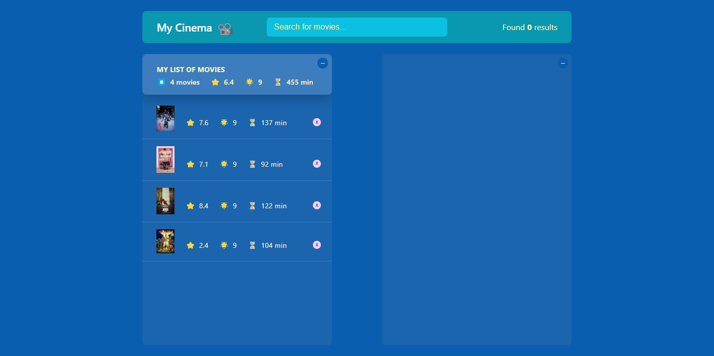

# Getting Started with My Cinema

Welcome to My Cinema! This guide will help you set up and run the app on your local machine.

## Prerequisites

Ensure you have Node.js and npm installed on your system.

## Installation

1. **Clone the Repository**: 

   ```bash
   git clone https://github.com/PuenaruIonutMarian/MyCinema.git
   ```

2. **Navigate to the Project Directory**:

   ```bash
   cd usepopcorn
   ```

3. **Install Dependencies**:

   ```bash
   npm install
   ```

## Running the App

Start the development server with:

```bash
npm start
```

Then, open [http://localhost:3000](http://localhost:3000) to view it in your browser.

## Environment Variables

Create a `.env` file in the root of the project and add your OMDB API key:

```
REACT_APP_API_KEY=your_api_key_here
```

## Contributing

Contributions are welcome! Please feel free to submit a pull request or open an issue.

## License

This project is licensed under the MIT License.
# MyCinema
